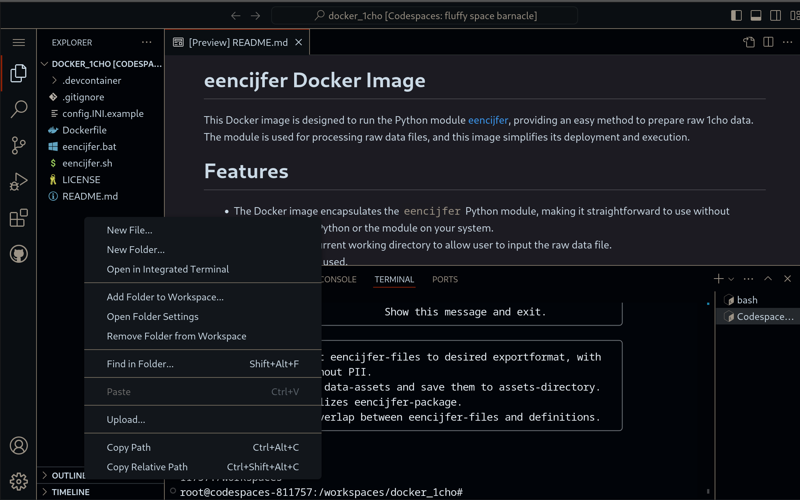
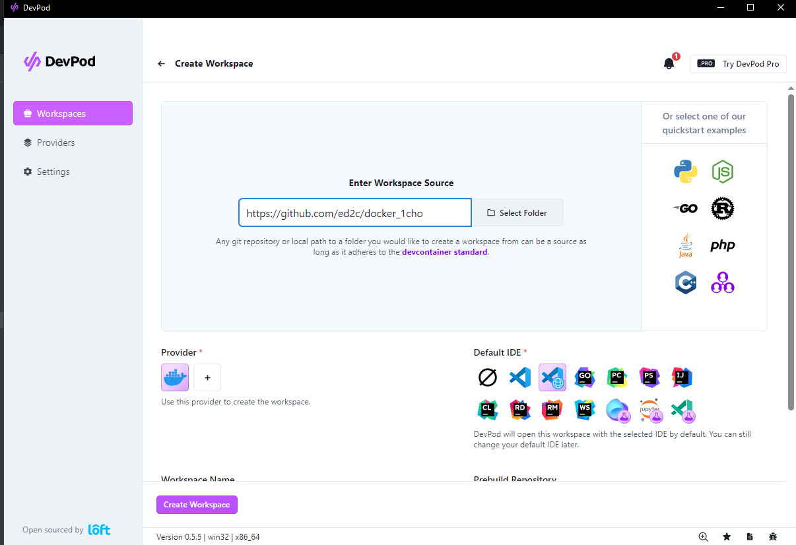
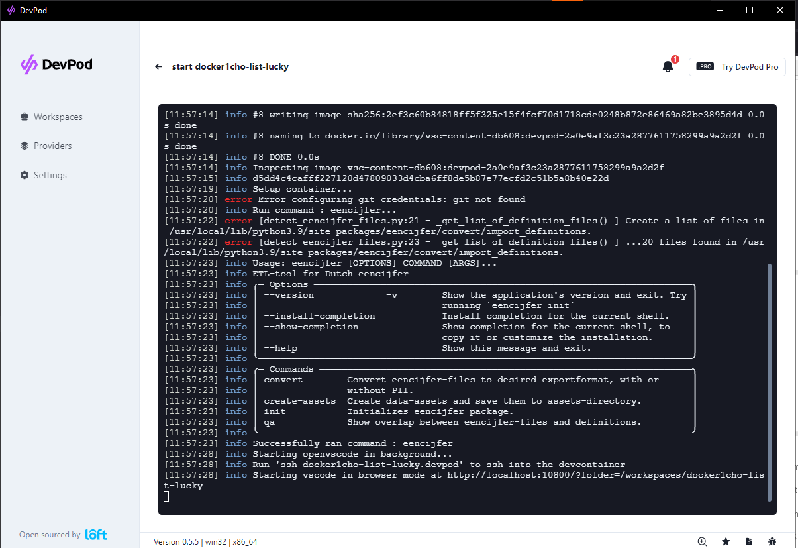
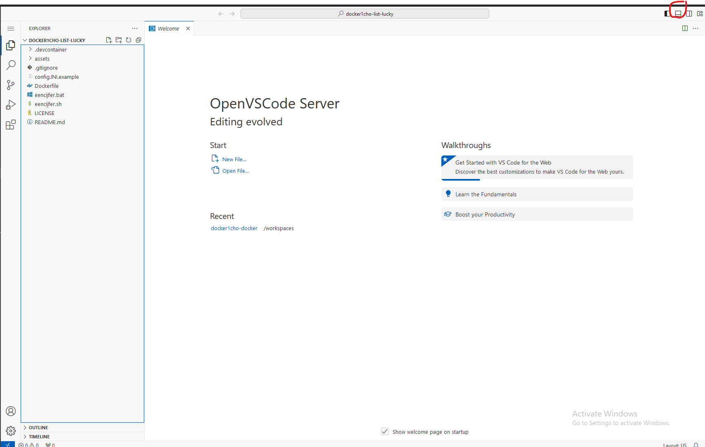
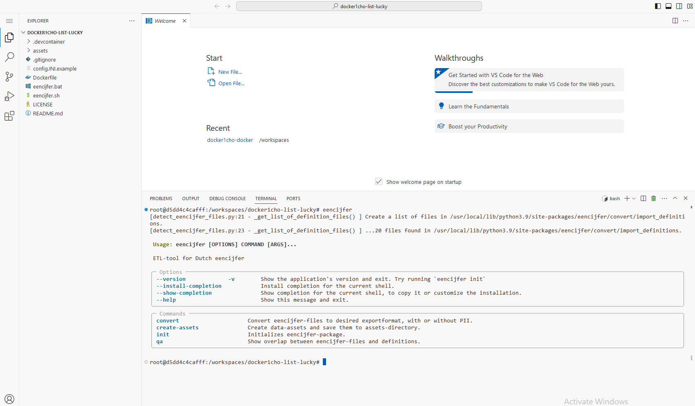

# eencijfer Docker

This Docker image is designed to run the Python module [eencijfer](https://github.com/enningb/eencijfer), providing an easy method to prepare raw 1cho data. 
The module is used for processing raw data files, and this image simplifies its deployment and execution.

We have provided three methods to work with this python module with as little pre-requisites as possible:

- [Docker](#Docker)
- [GitHub Codespaces](#Github-Codespaces)
- [DevPod](#Devpod)

> [!WARNING]  
> **Important Note:** Do not upload "1cho" data files containing sensitive data to GitHub Codespace!
> Only upload "Decodering" files, which filenames start with "Dec_"

# Docker

## Features

- The Docker image encapsulates the `eencijfer` Python module, making it straightforward to use without needing to install Python or the module on your system.
- Dockerfile maps current working directory to allow user to input the raw data file.
- A config.INI can be used.

# Prerequisites

Ensure Docker is installed on your system. Docker is necessary to run the eencijfer module encapsulated within the Docker image.

You can download Docker for your system through the following link [Docker](https://docs.docker.com/get-docker/).

# Configuration

There is no configuration needed. If users want to take advantage of the config.INI possibilities of the Python eencijfer package, users can put a config.INI in the cwd to tailor the processing according to their specific use case. An example file is given (config.INI.example, rename this to config.INI and adapt contents to tailor your needs.). 
The default configuration assumes reading and writing from the current working directory where the batch or bat script is executed. This means you do not need to specify paths unless you wish to change the default behavior.

# Directories

A `result` directory will be automatically created and populated with the processed files once the `eencijfer` module has completed its processing. 
This directory will be located in the current working directory where the batch or bat script is run, when using the `default` config settings.

# Running the Docker Image

  To run the Docker image, execute the provided batch or bat script. This script will handle the Docker run command, ensuring that the `eencijfer` module is executed within the Docker container.
  The script will automatically map the current working directory to the Docker container, allowing you to easily input the raw data file for processing.

# Example Usage

- Place your raw data files in the directory you wish to run the batch or bat script.
- Run the batch or bat script.
- After processing, the result directory will contain the processed files.

# Troubleshooting

If you encounter any issues, ensure that Docker is running correctly on your system.
Check the Docker logs for any error messages that may indicate what went wrong during the execution.

# Codespaces
## GitHub Codespaces

> [!WARNING]  
> **Important Note:** Do not upload "1cho" data files containing sensitive data to the Codespace!
>
> Instead, opt for the devpod solution described in the next section.

This repository supports GitHub Codespaces, which allows you to create a cloud-based development environment directly from the repository. To create a Codespace, follow these steps:

1. Click on the "Code" button in the repository.
2. Select "Create codespace on main" from the dropdown menu.

This will launch a Visual Studio Code instance hosted on GitHub, with the `eencijfer` module pre-installed. You can access the terminal within the Codespace and install any additional dependencies or run commands as needed. To upload "Decodering" files, right-click within the Codespace and select "Upload..." 

In order to convert the raw files, run the command `eencijfer convert` in the terminal. This will convert to parquest files by default, in order to wite to csv you should run `eencijfer convert --export-format csv`.

Please note that you should not upload "1cho" data files containing sensitive data. Instead, use the devpod solution described below. 

Accompanying screenshots of the above steps

1. Click on the "Code" button in the repository.
   

2. Select "Create codespace on main" from the dropdown menu.

3. Within a few minutes your codespace is ready and you are greeted with the man page of the `eencijfer` module

4. Upload your files to transform by right-clicking and choosing `Upload...` 

## Devpod
An alternative to using GitHub Codespaces is to use the devpod solution. Follow these steps:

- Make Sure to have Docker Desktop installed and running on your system. 
- Download the devpod for your operating system from the devpod repository. [DevPod](https://devpod.sh/)
- Link the devpod to this repository.
- Launch the devpod workspace.

The devpod solution provides a secure and isolated environment for working with sensitive data files.

Accompanying screenshots of the above steps

1. Launch DevPod and create workspace by linking to this repository.
   

2. Wait for the workspace to start up, you should see the man page of the `eencijfer` python module.

3. The browser should launch a vscode instance in the browser, click the circled button to toggle the terminal.

4. Run `eencijfer` command in the terminal.

5. Upload your files to transform by right-clicking and choosing `Upload...` 

Right click on the file browser in order to upload files to the workspace.

